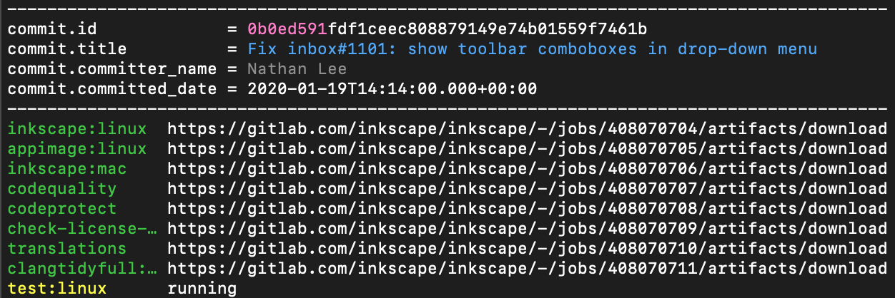

# get artifacts by commit sha

Get a list of download URLs for all CI artifacts for a given commit hash.



The output uses the same coloring scheme as jobmon. The short part for the commit hash is highlighted. The CI job names are colored to represent the job status: green for success, red for failure, yellow for running, ...

## Usage

### Prerequisites

In addition to the general prerequisites you need the [sty](https://sty.mewo.dev/index.html) package and a terminal supporting 256 colors and ANSI control characters.

```bash
pip3 install sty             # ANSI control for terminal colors
```

### invocation

Run the script:

```bash
./artifacts_by_sha.py <commit>
```
