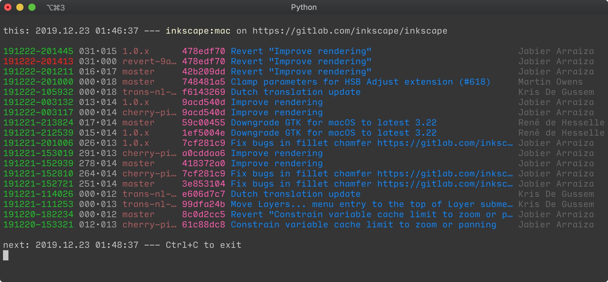
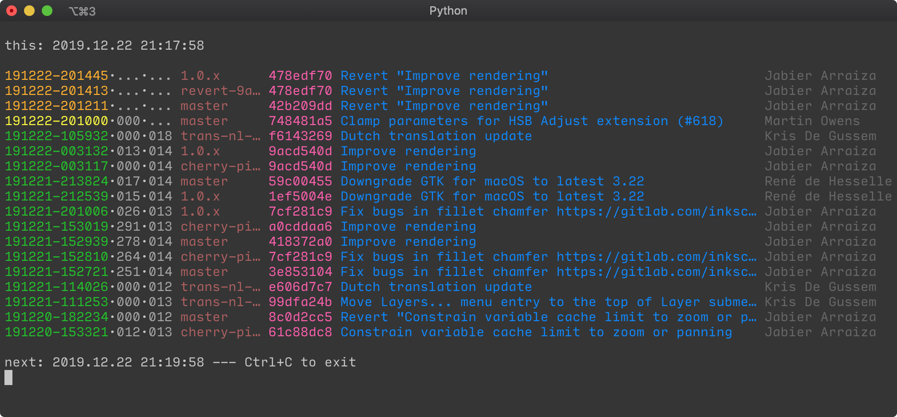

# Job monitor for GitLab CI

Print a self-updating status page about specific GitLab CI jobs in the terminal.



There are 6 columns:

- ___job created___ column as timestamp in `%y%m%d-%H%M%S` format
  - orange for pending jobs
  - yellow for running jobs
  - green for successfully completed jobs
  - red for failed jobs
- ___combined "job started" and "job finished"___ column, each as 3-digit value in "minutes since job creation" and "minutes since job start" in `NNN·NNN` format
- ___git reference___ column, limited to 10 chars
- ___commit hash___ column, short form
- ___commit message___ column, first line only and limited to 52 chars
- ___author___ column, limited to 16 chars

And this is what it looks like with pending and running jobs.



## Usage

### Prerequisites

In addition to the general prerequisites you need the [sty](https://sty.mewo.dev/index.html) package and a terminal supporting 256 colors and ANSI control characters.

```bash
pip3 install sty             # ANSI control for terminal colors
```

### configuration file

Add the following section to your `$XDG_CONFIG_HOME/gitlabci.ini`:

```ini
[jobmon]
update = 120
ci_job = someName
```

- Set the refresh interval in seconds in `update`.
- Set the [CI job name](https://docs.gitlab.com/ee/ci/yaml) in `ci_job`.

### invocation

Run the script:

```bash
./jobmon.py
```

Alternatively, you can specify a custom file for your configuration:

```bash
./jobmon.py -f <your configuration file>
```
